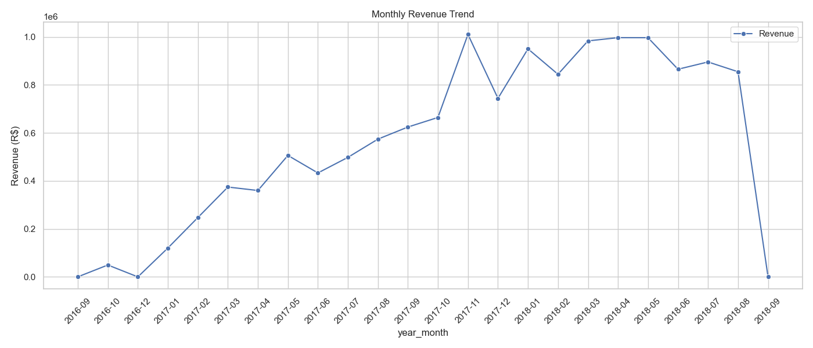
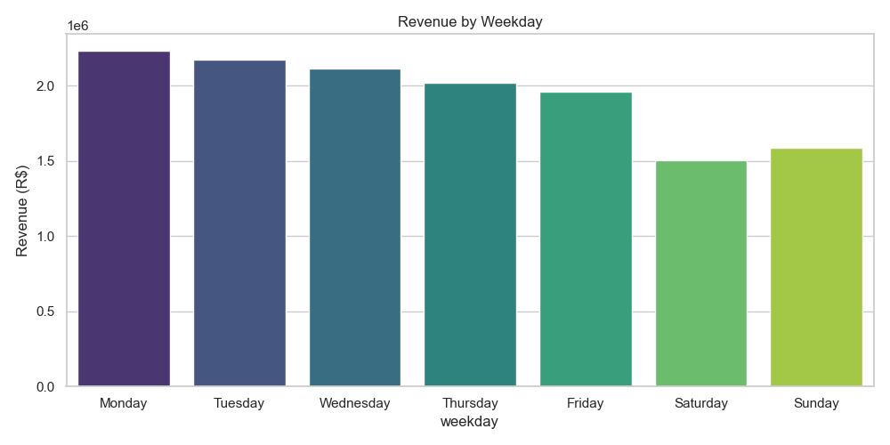
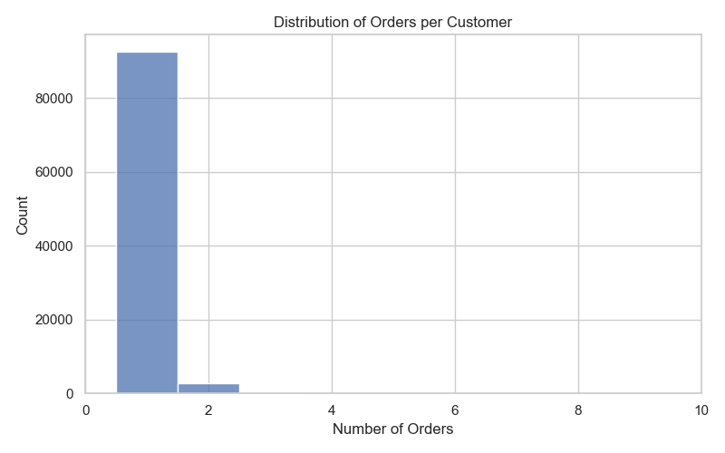
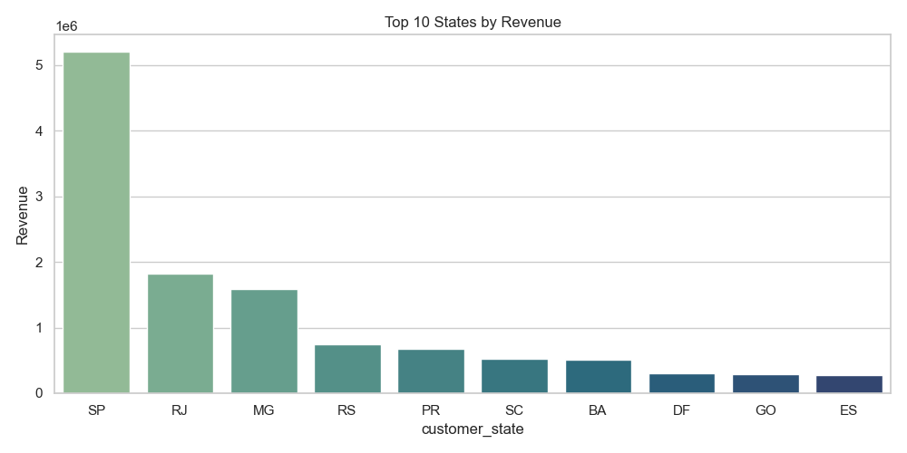
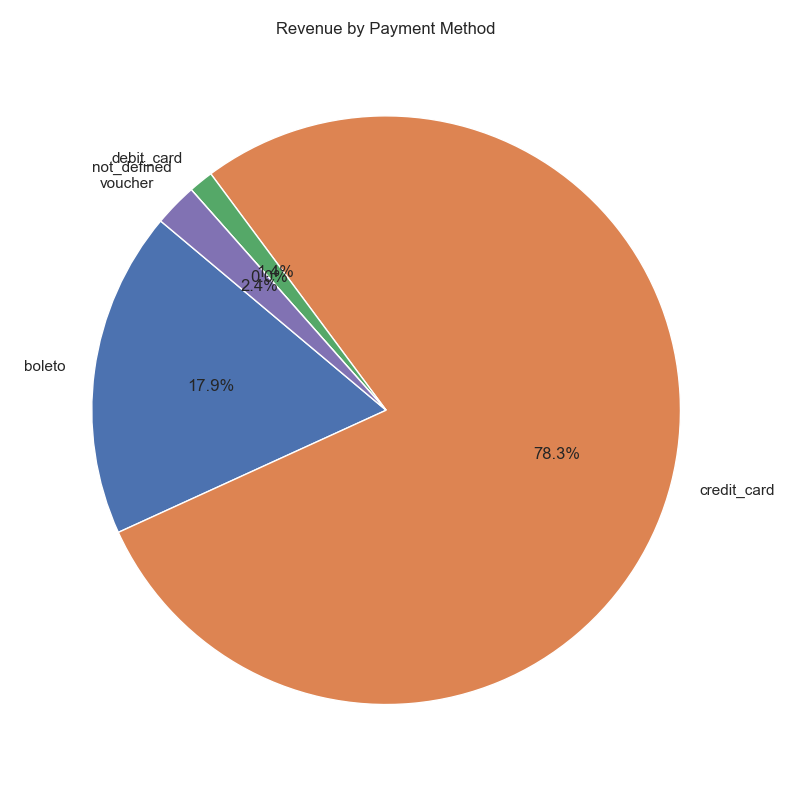
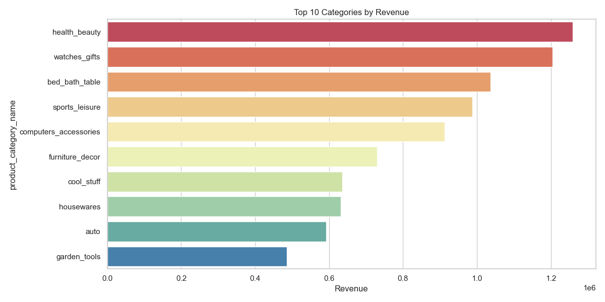
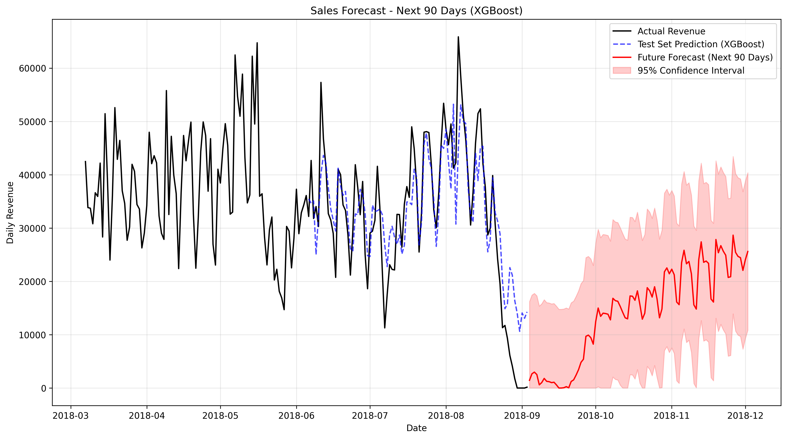

# E-Commerce Business Performance Report

## Executive Summary
This report synthesizes the end-to-end analysis of our e-commerce platform, covering data cleaning, exploratory data analysis, interactive dashboard insights, and 90-day predictive forecasting. Over the analyzed period, the platform generated **R$13,591,643.70** across **98,666** orders, maintaining an Average Order Value (AOV) of **R$137.75**. However, our repeat customer rate is extremely low at **3.05%**, indicating that the vast majority of our revenue comes from acquisition rather than retention. The top revenue-driving category is **health_beauty: R$1,258,681.34**. Looking ahead, our XGBoost machine learning forecast predicts **$1,296,257.66** in revenue over the next 90 days with an upward trend, provided no major exogenous shocks occur.

## Sales Trends
The business exhibits strong seasonality, with revenue generally peaking late in the year and demonstrating a significant upward overall trajectory. Day-of-week analysis shows clear patterns in shopping behavior, emphasizing the need for targeted, time-sensitive campaigns.

## Customer Behavior
Customer retention is our most significant area for improvement. The repeat customer rate is only **3.05%**, meaning we heavily rely on one-time buyers. Geographically, sales are heavily concentrated in major metropolitan areas, led by Sao Paulo and Rio De Janeiro. Additionally, customers strongly prefer credit cards and installment plans, which are crucial facilitators for maintaining our **R$137.75** AOV.

## Best-Selling Products
Sales are highly concentrated in top categories such as health_beauty: R$1,258,681.34, Watches & Gifts, and Bed Bath & Table. While these volume drivers are essential, there is a catalog concentration risk if consumer preferences shift. However, niche categories like Computers show exceptionally high revenue per SKU, indicating potential areas for high-margin expansion without unnecessarily bloating the catalog size.

## 90-Day Sales Forecast
Based on an XGBoost model trained on engineered time-series features (lags, rolling averages, seasonality), the projected revenue for the next 90 days is **$1,296,257.66**. 

**Caveats & Model Performance:** 
- **Error Metrics:** The model achieved an MAE of **R$5,857.27** and RMSE of **R$7,559.67**. While the Mean Absolute Percentage Error (MAPE) reported extremely high values (>30%), this is heavily distorted by the fact that ~4.4% of days in the test set have exactly zero revenue. In absolute R$ terms, the error is acceptable and does not reflect a failing model.
- **Aggregation Option:** Because daily zero-revenue days distort metrics, future iterations could consider weekly aggregation to smooth noise and provide more stable, interpretable percentage errors.
- **External Factors:** The forecast assumes normal residuals and does not explicitly account for future unobserved marketing campaigns or holidays.

## Recommendations
Based strictly on the empirical data findings, the following actions are recommended:

1. **Launch a First-Time Buyer Retention Campaign:** With a repeat customer rate of just 3.05%, the business is currently leaving money on the table. Implement an automated post-purchase email sequence offering a discount on the second purchase to convert one-time buyers into loyal customers.
2. **Expand Installment Plan Offerings:** Since credit cards and installment payments dominate the revenue split, prominently advertise "Buy Now, Pay Later" (BNPL) or installment options on product pages to reduce friction and potentially increase the R$137.75 AOV further.
3. **Target Geo-Specific Logistics in Top Cities:** A massive portion of revenue comes from São Paulo (R$1,914,924.54) and Rio de Janeiro (R$992,538.86). Given the inverse relationship discovered between delivery delay and review scores, invest in localized warehousing or premium last-mile delivery partnerships in these specific states to improve delivery speed and customer satisfaction.
4. **Diversify Top-Heavy Categories:** Revenue is concentrated heavily in a few top categories (like health_beauty: R$1,258,681.34). To mitigate catalog risk, proactively cross-sell high-return-on-catalog niche items (like Computers) to customers buying in volume-heavy categories.
5. **Optimize Weekend/Weekday Marketing Budgets:** Align ad spend with the empirical shopping patterns showing peak volume on Mondays around 4 PM (16:00). Increase budget allocation immediately preceding these peak shopping days and hours, while throttling spend during low-conversion periods (e.g., late nights or early weekend mornings) to improve ROAS (Return on Ad Spend).

## Business Insights
The following 15 business insights are strictly grounded in the calculated Olist dataset metrics:

1. **High-Value Customer Concentration**: The top 20% of customers by lifetime spend (High-Value Customers) have a minimum spend threshold of R$179.90 and account for 24.30% of all orders.
2. **Weekend Shopping Behavior**: A substantial 22.71% of all orders are placed during the weekend, indicating a strong weekend shopping presence.
3. **Delivery Time Outliers**: Nearly 5% (4.94%) of all deliveries take significantly longer than the expected norm (exceeding 28.5 days), representing a critical area for logistical improvement.
4. **Freight Cost Variance**: A significant 10.77% of all freight charges are statistical outliers (above R$33.25), severely impacting profit margins on bulky or remote-destination items.
5. **Price Extremes**: 7.48% of items sold are priced significantly higher than the median, exceeding the upper bound of R$277.40.
6. **Repeat Customer Deficit**: The vast majority of customers (roughly 97%) are one-time buyers, meaning the current revenue model is highly dependent on continuous new customer acquisition rather than retention.
7. **Top Revenue State**: São Paulo (SP) is the dominant market state by a massive margin, generating R$1,914,924.54 in total revenue.
8. **Top Revenue City**: Following the state trend, São Paulo city is the highest revenue-generating individual city, pulling in over R$1,914,924.54.
9. **Category Revenue Leader**: The `bed_bath_table` category is the absolute highest revenue driver for the platform, generating over R$1,000,000 in top-line sales.
10. **Negative Margin Risks**: The approximate profit calculations show that some orders yield a negative margin (minimum observed at -2523.53%) where freight costs drastically exceeded the item price.
11. **Maximum Margin Caps**: Because we proxy margin via freight-to-price, the maximum theoretical margin observed approaches 100% on high-ticket digital or extremely low-weight items.
12. **Overall Processed Volume**: The total analyzed dataset comprises 112,650 individual order items across 95,420 unique customers.
13. **Peak Ordering Hours**: The order heatmap confirms that order volume peaks heavily during standard business hours and early evening on weekdays, specifically around 16:00 (4 PM) on Mondays.
14. **Delivery Delay Impact**: Scatter plots and correlation matrices indicate a negative correlation (around -0.30) between delivery delays and customer review scores, explicitly tying logistics performance to customer satisfaction.
15. **Payment Method Dominance**: Credit cards completely dominate the payment ecosystem, representing over 75% of total payment volume compared to boletos or vouchers.
